# Contributing to UZP-CLI

Thank you for your interest in contributing to UZP-CLI! This guide covers everything from quick setup to comprehensive development practices.

## 🚀 **Quick Start - Get Contributing in 5 Minutes**

### TL;DR - Super Quick Setup
```bash
# 1. Fork on GitHub, then:
git clone https://github.com/YOUR_USERNAME/uzp-cli.git
cd uzp-cli

# 2. Create your feature branch
git checkout -b feature/your-feature-name

# 3. Make changes, test locally
go run . --help  # Test your changes

# 4. Commit and push
git add .
git commit -m "feat: add awesome feature"
git push origin feature/your-feature-name

# 5. Create PR on GitHub
```

**That's it!** 🎉 CI will test everything automatically, and if you're changing non-critical files, your PR can be merged quickly after CI passes.

### 🧪 **Quick Testing - Before You Submit**
```bash
# Test your changes work
go build -o uzp .
./uzp --help                    # Basic functionality
./uzp init                      # Test init command
./uzp add test-entry           # Test add command

# Run tests
go test ./...

# That's enough! CI will do comprehensive testing
```

### 🤝 What Can You Contribute?

| Type | Examples | Approval Process |
|------|----------|------------------|
| 🐛 **Bug Fixes** | Fix commands, error handling | ✅ CI passes → Ready to merge |
| ✨ **Features** | New commands, utilities | ✅ CI passes → Ready to merge |
| 📚 **Documentation** | README, help text, examples | ✅ CI passes → Ready to merge |
| 🧹 **Code Cleanup** | Refactoring, optimization | ✅ CI passes → Ready to merge |
| 🔒 **Security Code** | Crypto, storage core | 🔍 Owner review required |

**Most contributions only need CI to pass!** Only core security files need manual review.

---

## 🔍 **How the Review Process Works**

### ✅ **Regular Code Changes** (90% of PRs)


**Files that follow this path:**
- `/cmd/` - CLI commands
- `/internal/utils/` - Utility functions  
- `*.md` - Documentation
- `/scripts/` - Build scripts (non-workflow)
- Test files

**Process:**
1. You submit PR
2. GitHub Actions runs tests automatically
3. If CI passes → PR is **ready to merge** (no manual review needed)
4. Maintainer merges when convenient

### 🔒 **Security-Critical Changes** (10% of PRs)

```mermaid
graph LR
    A[Submit PR] --> B[CI Runs]
    B --> C{CI Passes?}
    C -->|Yes| D[👑 Owner Review Required]
    C -->|No| E[Fix Issues]
    E --> B
    D --> F{Review Approved?}
    F -->|Yes| G[Merge]
    F -->|No| H[Address Feedback]
    H --> D
```


**Files that require owner review:**
- `/internal/crypto/` - Encryption/decryption
- `/internal/storage/` - Vault storage logic
- `/.github/workflows/` - CI/CD security
- `/package.json` - Dependencies
- `/go.mod` - Go dependencies
- `/SECURITY.md` - Security policy

**Process:**
1. You submit PR  
2. CI runs automatically
3. Even if CI passes → **Manual review required** from owner
4. Owner reviews security implications
5. Owner approves → Merge

### 🤖 **What CI Checks Automatically**

Our CI pipeline runs these checks on **every PR**:

```yaml
✅ Go Tests: go test ./...
✅ Build Test: Cross-platform builds (Linux, macOS, Windows)  
✅ Code Lint: golangci-lint
✅ Security Scan: gosec, nancy vulnerability scanner
✅ Node.js Package: npm install test
```

**If CI fails → PR cannot be merged** (regardless of file type)

## 🤖 **Automated Review System**

uzp-cli uses **GitHub Copilot and automated security scanning** to help maintain code quality and security:

### **🔍 What Happens When You Submit a PR:**

```mermaid
graph TD
    A[Submit PR] --> B[Automated Review System Activates]
    B --> C[🔒 Security Scanner]
    B --> D[📝 GitHub Copilot]
    B --> E[✅ Checklist Validator]
    
    C --> F{Security Issues?}
    D --> G[Code Quality Review]
    E --> H[PR Checklist Check]
    
    F -->|Yes| I[🚨 Security Gate]
    F -->|No| J[✅ Security Passed]
    
    I --> K[👑 Owner Review Required]
    J --> L[Ready for Review]
    G --> L
    H --> L
```



### **🤖 Automated Review Features:**

#### **1. GitHub Copilot (@github-copilot)**
- **Focuses on**: Security, performance, code quality, testing
- **What it does**: AI-powered code review with specific suggestions
- **Commands**: 
  - `@github-copilot review` - Comprehensive code review
  - `@github-copilot explain this` - Code explanation
  - `@github-copilot suggest improvement` - Improvement suggestions

#### **2. Automated Security Scanner**
- **Checks**: Hardcoded secrets, weak crypto, error handling, vulnerabilities
- **Triggers**: All Go code changes, especially crypto/storage files
- **Actions**: Auto-labels, security gate activation, detailed security reports

#### **3. PR Checklist Validator**
- **Validates**: Testing completed, documentation updated, security checklist
- **Blocks**: Merge if critical checklist items incomplete for security changes

### **🎭 Sample Automated Review Comments:**

**GitHub Actions Bot:**
```markdown
🤖 Automated PR Review

**PR Summary:**
- 📊 Files changed: 3  
- 👤 Author: @yourusername
- 🌿 Branch: feature/new-encryption → main

### 🔒 Security Review
**Security-related files changed:**
- internal/crypto/encryption.go
- internal/storage/vault.go

✅ No obvious security issues detected

### 📝 Code Quality Review
📋 Quality Suggestions:
- Consider adding error handling for line 42 in encryption.go
- Function EncryptData could benefit from documentation
- Add tests for edge cases in vault.go

### 🎯 Next Steps
- 👑 **Owner review required** for security changes
- ✅ Ensure all CI checks pass
- 📝 Update tests if needed
```

**GitHub Copilot (when mentioned):**
```markdown
@github-copilot review

I've reviewed your PR focusing on security and code quality:

🔒 **Security Analysis:**
- Line 42: Consider using constant-time comparison for password validation
- Line 78: Ensure sensitive data is cleared from memory after use

📝 **Code Quality:**
- Function `EncryptData` could benefit from input validation
- Consider adding unit tests for error handling edge cases

⚡ **Performance:**
- Consider caching the derived key if password doesn't change
```

### **🔒 Security Gate System:**

For **security-critical changes**, our Security Gate automatically:

1. **🏷️ Labels PR** with `security-review-required`
2. **🚨 Blocks merge** until owner approval  
3. **📋 Posts security checklist** for review
4. **🔍 Runs enhanced security scans**

**Security files that trigger Security Gate:**
- `internal/crypto/` - Encryption/decryption core
- `internal/storage/` - Vault storage logic
- `.github/workflows/` - CI/CD security
- `go.mod` - Dependency changes

### **🎯 Available Commands:**

| Command | Purpose |
|---------|---------|
| `@github-copilot review` | Complete AI-powered code review |
| `@github-copilot explain this` | Explain specific code sections |
| `@github-copilot suggest improvement` | Get improvement suggestions |
| `/rerun-security-scan` | Re-run automated security checks |

### **📊 Automated Review Benefits:**

- **⚡ Instant feedback** from automated security scanner (< 2 minutes)
- **🔒 Security issues** detected before human review
- **🤖 AI-powered suggestions** from GitHub Copilot when requested
- **📚 Learning opportunities** through detailed code feedback
- **🚀 Faster PR cycle** with automated checks

This streamlined system ensures **fast feedback** while maintaining **high security standards** for our password manager! 🔒

### 📋 **Branch Protection Rules**

```yaml
Main Branch Protection:
  ✅ Require PR before merge
  ✅ Require status checks (CI must pass)
  ✅ Require conversation resolution
  ❌ Auto-merge enabled: No (manual merge only)
  
CODEOWNERS Protection:
  🔒 Critical files: Owner approval required
  🟢 Other files: No approval required (after CI)
```

**"Auto-merge" = Ready to merge after CI, no manual review bottleneck**

---

## 🚀 **Release Process**

### 📦 **How Releases Work**

UZP-CLI follows semantic versioning and regular release cycles:

```yaml
Version Format: vMAJOR.MINOR.PATCH
Examples: v1.0.0, v1.1.0, v1.0.1

Release Types:
  🔴 Major (v1.0.0 → v2.0.0): Breaking changes
  🟡 Minor (v1.0.0 → v1.1.0): New features, backward compatible  
  🟢 Patch (v1.0.0 → v1.0.1): Bug fixes, security updates
```

### 📅 **Release Schedule**

- 🟢 **Patch releases**: As needed for critical bugs/security
- 🟡 **Minor releases**: Monthly (new features)
- 🔴 **Major releases**: When breaking changes are necessary

### 🎯 **When Your Contribution Gets Released**

| Contribution Type | Release Timeline |
|-------------------|------------------|
| 🐛 **Critical Bug Fix** | Next patch release (within days) |
| 🔒 **Security Fix** | Immediate patch release |
| ✨ **New Feature** | Next minor release (monthly) |
| 📚 **Documentation** | Next minor release |
| 💥 **Breaking Change** | Next major release |

### 📋 **Release Notes**

All releases include detailed notes covering:
- ✨ New features and improvements
- 🐛 Bug fixes and security updates  
- 💥 Breaking changes and migration guides
- 🙏 Contributor acknowledgments

**Your contributions will be credited in release notes!** 🎉

### 🔔 **Stay Updated**

- 📧 **Watch releases**: Click "Watch" → "Releases only" on GitHub
- 📦 **NPM notifications**: `npm view uzp-cli versions --json`
- 🐙 **GitHub releases**: https://github.com/hungnguyen18/uzp-cli/releases

---

## 🎯 **Project Philosophy**

UZP-CLI is a **security-focused** tool that handles sensitive data. Every contribution must maintain the highest standards of:
- **Security**: Protecting user secrets and privacy
- **Reliability**: Zero data loss, consistent behavior
- **Performance**: Minimal overhead, efficient operations
- **Maintainability**: Clean, readable, and extensible code

## 📋 **Table of Contents**

- [Quick Start](#-quick-start---get-contributing-in-5-minutes)
- [Review Process](#-how-the-review-process-works)
- [Release Process](#-release-process)
- [Getting Started](#-getting-started)
- [Development Workflow](#-development-workflow)
- [Code Standards](#-code-standards)
- [Security Guidelines](#-security-guidelines)
- [Testing Requirements](#-testing-requirements)
- [Commit Standards](#-commit-standards)
- [Pull Request Process](#-pull-request-process)
- [Architecture Guidelines](#-architecture-guidelines)

## 🚀 **Getting Started**

### Prerequisites

- **Go**: 1.23.10+ (for core CLI development, required for security fixes)
- **Node.js**: 18+ (for build scripts and tooling)
- **Git**: 2.30+ with proper configuration

> **⚠️ Important**: Go 1.23.10+ is required to avoid security vulnerability [GO-2025-3750](https://pkg.go.dev/vuln/GO-2025-3750) in file operations.

### Initial Setup

```bash
# 1. Fork the repository
# 2. Clone your fork
git clone https://github.com/YOUR_USERNAME/uzp-cli.git
cd uzp-cli

# 3. Add upstream remote
git remote add upstream https://github.com/hungnguyen18/uzp-cli.git

# 4. Create development environment
cp .npmrc.example .npmrc  # If using custom registries

# 5. Install dependencies and build
npm install
go mod download
./scripts/build.sh

# 6. Verify installation
./uzp --version
```

### Environment Configuration

```bash
# Development environment variables (optional)
export UZP_DEBUG=true          # Enable debug logging
export UZP_TEST_MODE=true      # Use test vault location
export UZP_VAULT_PATH=./test.vault  # Custom vault for testing
```

## 🔄 **Development Workflow**

### Branch Strategy

We use a **merge-based Git model** with clear branch naming conventions:

```bash
# Branch naming format: <prefix>/<description_in_snake_case>
feature/add_backup_encryption
bug/fix_clipboard_memory_leak
hotfix/critical_vault_corruption
devops/update_github_actions
misc/cleanup_unused_imports
```

**Branch Prefixes:**
- `feature/` - New functionality
- `bug/` - Bug fixes  
- `hotfix/` - Urgent production fixes
- `devops/` - CI/CD, infrastructure changes
- `misc/` - Minor improvements, cleanup

### Creating a Feature Branch

```bash
# Always start from updated main
git checkout main
git pull upstream main

# Create feature branch
git checkout -b feature/add_vault_export

# Make your changes...
git add .
git commit -m "feat: implement vault export functionality"

# Push to your fork
git push -u origin feature/add_vault_export
```

## 💻 **Code Standards**

### Go Code Guidelines

#### 1. **Package Structure**
```go
// Good: Clear package organization
package crypto
package storage  
package utils

// Good: Specific, descriptive names
func EncryptVaultData(data []byte, password string) ([]byte, error)
func CreateSecureVault(path string) error

// Bad: Generic, unclear names
func Process(data interface{}) interface{}
func DoSomething(target string)
```

#### 2. **Error Handling**
```go
// Good: Explicit error handling
vault, err := storage.LoadVault(vaultPath)
if err != nil {
    return fmt.Errorf("failed to load vault: %w", err)
}

// Good: Context-aware errors
if err := validateMasterPassword(password); err != nil {
    return fmt.Errorf("invalid master password: %w", err)
}

// Bad: Generic error handling
if err != nil {
    log.Println("error occurred")
    return nil
}
```

#### 3. **Security Practices**
```go
// Good: Clear sensitive data from memory
defer func() {
    for i := range password {
        password[i] = 0
    }
}()

// Good: Use crypto/rand for randomness
salt := make([]byte, 32)
if _, err := rand.Read(salt); err != nil {
    return fmt.Errorf("failed to generate salt: %w", err)
}

// Bad: Predictable or weak crypto
salt := []byte("fixed_salt") // ❌ Never use fixed salts
```

#### 4. **Variable Naming**
```go
// Good: Present tense, singular, specific
encryptedData := encrypt(plaintextData)
vaultEntry := storage.VaultEntry{Key: key, Value: value}
currentUser := getCurrentUser()

// Bad: Plural, past tense, generic
var datas []interface{}           // ❌ "datas" is not a word
var processedItems []interface{}  // ❌ past tense
var info map[string]interface{}   // ❌ too generic
```

### Node.js/JavaScript Guidelines

#### 1. **Function Parameters**
```javascript
// Good: Object parameters for multiple values
function createVault({ masterPassword, vaultPath, keyDerivationRounds }) {
  // Implementation
}

// Good: Destructuring with defaults
function encryptData({ 
  data, 
  algorithm = 'aes-256-gcm', 
  keyLength = 32 
}) {
  // Implementation
}

// Bad: Multiple positional parameters
function createVault(password, path, rounds, options, callback) {
  // Hard to remember parameter order
}
```

#### 2. **Async/Await Best Practices**
```javascript
// Good: Consistent async/await
async function processVaultEntry(entry) {
  try {
    const decrypted = await decryptEntry(entry);
    const validated = await validateEntry(decrypted);
    return await storeEntry(validated);
  } catch (error) {
    throw new Error(`Failed to process entry: ${error.message}`);
  }
}

// Bad: Mixing async patterns
function processEntry(entry) {
  return decryptEntry(entry).then(async (decrypted) => {
    validateEntry(decrypted).then(() => {
      return await storeEntry(decrypted); // ❌ Mixed patterns
    });
  });
}
```

#### 3. **Type Safety**
```javascript
// Good: Clear type definitions
/**
 * @typedef {Object} VaultEntry
 * @property {string} project - Project name
 * @property {string} key - Secret key
 * @property {string} value - Secret value
 * @property {Date} createdAt - Creation timestamp
 */

// Good: Input validation
function validateVaultEntry(entry) {
  if (!entry || typeof entry !== 'object') {
    throw new Error('Entry must be an object');
  }
  
  if (!entry.project || typeof entry.project !== 'string') {
    throw new Error('Project must be a non-empty string');
  }
}
```

## 🔒 **Security Guidelines**

### Mandatory Security Practices

#### 1. **Sensitive Data Handling**
```go
// Good: Immediate cleanup of sensitive data
password := getPasswordFromUser()
defer clearSensitiveData(&password)

key := deriveKey(password, salt)
defer clearSensitiveData(&key)

// Good: Minimal exposure time
func processSecret(encryptedSecret []byte) error {
    plaintext, err := decrypt(encryptedSecret)
    if err != nil {
        return err
    }
    defer clearSensitiveData(&plaintext) // Clear immediately after use
    
    return useSecret(plaintext)
}
```

#### 2. **Input Validation**
```go
// Good: Validate all external inputs
func ValidateProjectName(name string) error {
    if len(name) == 0 {
        return errors.New("project name cannot be empty")
    }
    
    if len(name) > 255 {
        return errors.New("project name too long")
    }
    
    if !regexp.MustCompile(`^[a-zA-Z0-9_-]+$`).MatchString(name) {
        return errors.New("project name contains invalid characters")
    }
    
    return nil
}
```

#### 3. **File Operations**
```go
// Good: Secure file permissions
func CreateVaultFile(path string) error {
    file, err := os.OpenFile(path, os.O_CREATE|os.O_WRONLY|os.O_EXCL, 0600)
    if err != nil {
        return fmt.Errorf("failed to create vault file: %w", err)
    }
    defer file.Close()
    
    return nil
}

// Good: Validate file paths
func ValidateVaultPath(path string) error {
    cleanPath := filepath.Clean(path)
    if path != cleanPath {
        return errors.New("invalid vault path")
    }
    
    // Prevent directory traversal
    if strings.Contains(path, "..") {
        return errors.New("vault path cannot contain parent directory references")
    }
    
    return nil
}
```

## ✅ **Testing Requirements**

### Test Categories

1. **Unit Tests**: Individual function testing
2. **Integration Tests**: Component interaction testing  
3. **Security Tests**: Cryptographic and security feature testing
4. **End-to-End Tests**: Full workflow testing

### Test Structure

```go
// Good: AAA Pattern (Arrange, Act, Assert)
func TestEncryptVaultData(t *testing.T) {
    // Arrange
    testData := []byte("sensitive test data")
    password := "test-password-123"
    
    // Act
    encrypted, err := EncryptVaultData(testData, password)
    
    // Assert
    require.NoError(t, err)
    assert.NotEqual(t, testData, encrypted)
    assert.Greater(t, len(encrypted), len(testData)) // Should be larger due to encryption overhead
    
    // Verify decryption works
    decrypted, err := DecryptVaultData(encrypted, password)
    require.NoError(t, err)
    assert.Equal(t, testData, decrypted)
}
```

### Security Test Examples

```go
func TestCryptographicSecurity(t *testing.T) {
    t.Run("encryption produces different output each time", func(t *testing.T) {
        data := []byte("test data")
        password := "password"
        
        encrypted1, _ := EncryptVaultData(data, password)
        encrypted2, _ := EncryptVaultData(data, password)
        
        assert.NotEqual(t, encrypted1, encrypted2, "Encryption should be non-deterministic")
    })
    
    t.Run("wrong password fails decryption", func(t *testing.T) {
        data := []byte("test data")
        correctPassword := "correct-password"
        wrongPassword := "wrong-password"
        
        encrypted, _ := EncryptVaultData(data, correctPassword)
        _, err := DecryptVaultData(encrypted, wrongPassword)
        
        assert.Error(t, err, "Decryption with wrong password should fail")
    })
}
```

## 📝 **Commit Standards**

### Commit Message Format

```
<type>(<scope>): <description>

[optional body]

[optional footer(s)]
```

### Commit Types

- `feat`: New features
- `fix`: Bug fixes
- `security`: Security improvements
- `perf`: Performance optimizations
- `refactor`: Code restructuring without functionality changes
- `test`: Adding or updating tests
- `docs`: Documentation updates
- `style`: Code formatting changes
- `ci`: CI/CD configuration changes

### Examples

```bash
# Good commit messages
feat(crypto): implement AES-256-GCM encryption for vault data
fix(clipboard): prevent memory leak when clearing clipboard
security(auth): strengthen master password validation
perf(storage): optimize vault file reading for large datasets
refactor(cli): extract command logic into separate modules

# Bad commit messages
fix: bug fix          # ❌ Too vague
update code          # ❌ No context
WIP                  # ❌ Work in progress commits should be squashed
```

### Commit Body Guidelines

```bash
feat(backup): add encrypted vault backup functionality

Implement automatic encrypted backups with the following features:
- AES-256-GCM encryption using master password derivative
- Configurable backup intervals (daily, weekly, monthly)
- Backup rotation to prevent disk space issues
- Verification of backup integrity on creation

Resolves: #123
Breaking Change: Backup location changed from ~/.uzp/backup to ~/.uzp/backups
```

## 🔀 **Pull Request Process**

### Before Creating a PR

1. **Sync with upstream**:
   ```bash
   git checkout main
   git pull upstream main
   git checkout your-feature-branch
   git rebase main  # or merge if preferred
   ```

2. **Run full test suite**:
   ```bash
   go test ./...
   npm test
   ./scripts/build.sh
   ```

3. **Security check**:
   ```bash
   # Check for hardcoded secrets
   git secrets --scan-history
   
   # Dependency audit
   go mod audit
   npm audit
   ```

### PR Title and Description

**Title Format**: `<type>(<scope>): <description>`

**Description Template**:
```markdown
## Summary
Brief description of changes made.

## Type of Change
- [ ] Bug fix (non-breaking change which fixes an issue)
- [ ] New feature (non-breaking change which adds functionality)
- [ ] Breaking change (fix or feature that would cause existing functionality to not work as expected)
- [ ] Security enhancement
- [ ] Performance improvement
- [ ] Documentation update

## Testing
- [ ] Unit tests pass
- [ ] Integration tests pass
- [ ] Security tests pass
- [ ] Manual testing completed

## Security Considerations
Describe any security implications or improvements.

## Breaking Changes
List any breaking changes and migration steps.

## Screenshots/Logs
Include relevant screenshots or log outputs if applicable.
```

### Code Review Checklist

**For Reviewers**:
- [ ] Code follows established patterns and conventions
- [ ] Security best practices are followed
- [ ] Error handling is comprehensive
- [ ] Tests are adequate and meaningful
- [ ] Documentation is updated if needed
- [ ] No sensitive data is exposed
- [ ] Performance implications are considered

**For Authors**:
- [ ] Self-review completed
- [ ] All tests pass locally
- [ ] Documentation updated
- [ ] Commit messages are clear and descriptive
- [ ] No debug code or console.log statements
- [ ] Security implications considered

## 🏗️ **Architecture Guidelines**

### Project Structure

```
uzp-cli/
├── cmd/                    # CLI command implementations
│   ├── add.go             # Add command
│   ├── get.go             # Get command
│   └── root.go            # Root command and common logic
├── internal/              # Private application code
│   ├── crypto/            # Cryptographic operations
│   │   ├── crypto.go      # Main crypto functions
│   │   └── crypto_test.go # Crypto tests
│   ├── storage/           # Vault storage logic
│   │   ├── vault.go       # Vault operations
│   │   └── vault_test.go  # Storage tests
│   └── utils/             # Utility functions
│       ├── clipboard.go   # Clipboard operations
│       └── config.go      # Configuration handling
├── scripts/               # Build and deployment scripts
├── docs/                  # Documentation
└── tests/                 # Integration and E2E tests
```

## 🤝 **Community Guidelines**

### Code of Conduct

- **Be respectful**: Treat all contributors with respect
- **Be collaborative**: Work together constructively
- **Be professional**: Use appropriate language
- **Be patient**: Help newcomers learn our standards
- **Be security-conscious**: Always consider security implications

### Getting Help

- **Documentation**: Check README.md and docs/ first
- **Issues**: Search existing issues before creating new ones
- **Discussions**: Use GitHub Discussions for questions
- **Security**: Use private channels for security-related issues

---

**Thank you for contributing to UZP-CLI! Together, we're building a more secure way to manage secrets.** 🔐

For questions about this guide, please open an issue with the label `documentation`.

---

*Last updated: January 2025*
